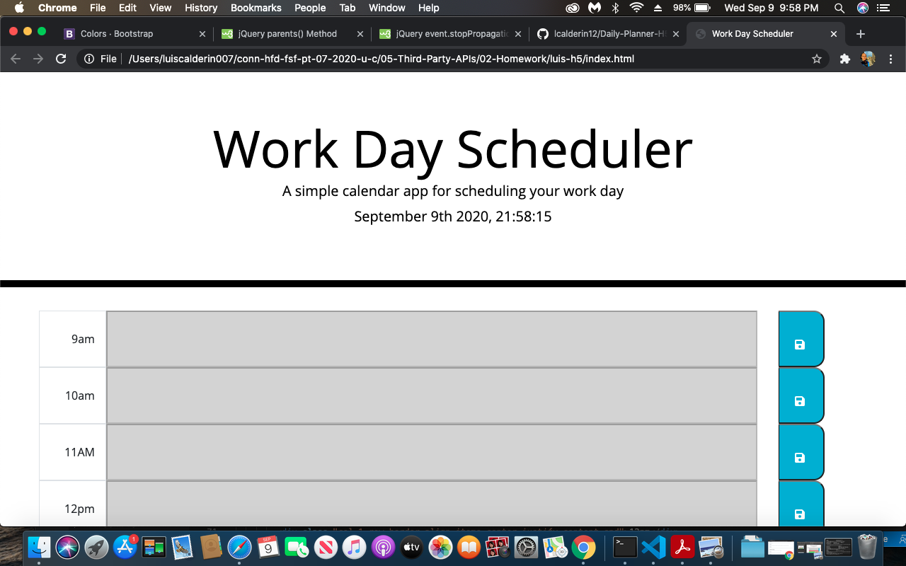
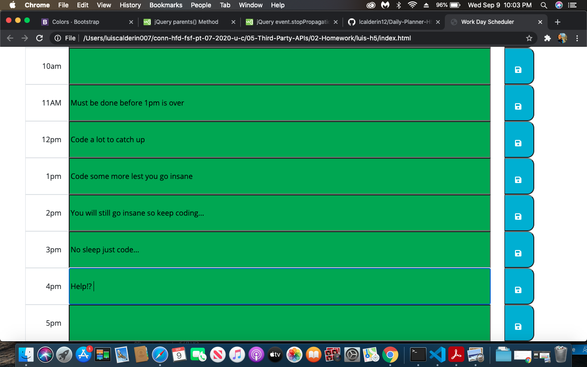

# 05 Third-Party APIs: Work Day Scheduler

Plan your 9 to 5 with this hourly planner. You will type your daily tasks at work in each hourly spot. If the hour is past the actual time, then you will not be able to populate the information. The row will become grayed out. You will be aware of what areas you could populate based on the color of the timmespan. Green will indicate future slots where you can type your tasks. Stay organized ladies and gents...
[github link] https://github.com/lcalderin12/Daily-Planner-H5

